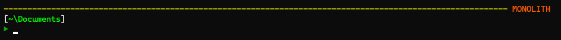

WieldingAnsi
============

:warning: This is a work in progress so the master branch could break your Powershell profile until it is deemed stable.:warning: 

WieldingAnsi is Powershell module that contains variables and functions to make using ANSI escape codes easier.

Documentation is forthcoming.  Until then here is a quick example.

You can use the `$Wansi` Class in your everyday Powershell life. You now can mix all 256 colors and styles on a single Write-Host line without remembering all of the escape sequences. You can just use `Show-AnsiCodes` to see the available values and plop them in your script. I like a simple prompt with a separator line and domain identification since I log into many machines.  Here is my prompt function.

```powershell
Import-Module WieldingAnsi

function prompt {
  $line =  "-".PadRight($host.UI.RawUI.WindowSize.Width - $env:USERDOMAIN.Length - 1, "-")
  Write-Host "$($Wansi.F226)$line$($Wansi.F202) $($Wansi.BoldOn)$env:USERDOMAIN$($Wansi.R)"
  Write-Host "$($Wansi.F15)[$($Wansi.F46)$((Get-Location).Path.Replace($($HOME), '~'))$($Wansi.F15)]$($Wansi.R)" -NoNewline
  Write-Host "$($Wansi.F2)`n▶$($Wansi.R)" -NoNewline
 
  return " "
}
```

Which gives me this



You can use the modules `Write-Wansi` function to get the same result with this code.

```powershell
function prompt {
  $line =  "-".PadRight($host.UI.RawUI.WindowSize.Width - $env:USERDOMAIN.Length - 1, "-")
  Write-Wansi "{:F226:}$line{:F202:} {:BoldOn:}$env:USERDOMAIN{:R:}"
  Write-Wansi "{:F15:}[{:F46:}$((Get-Location).Path.Replace($($HOME), '~')){:F15:}]{:R:}"
  Write-Wansi "{:F2:}`n▶{:R:}"
 
  return " "
}

```