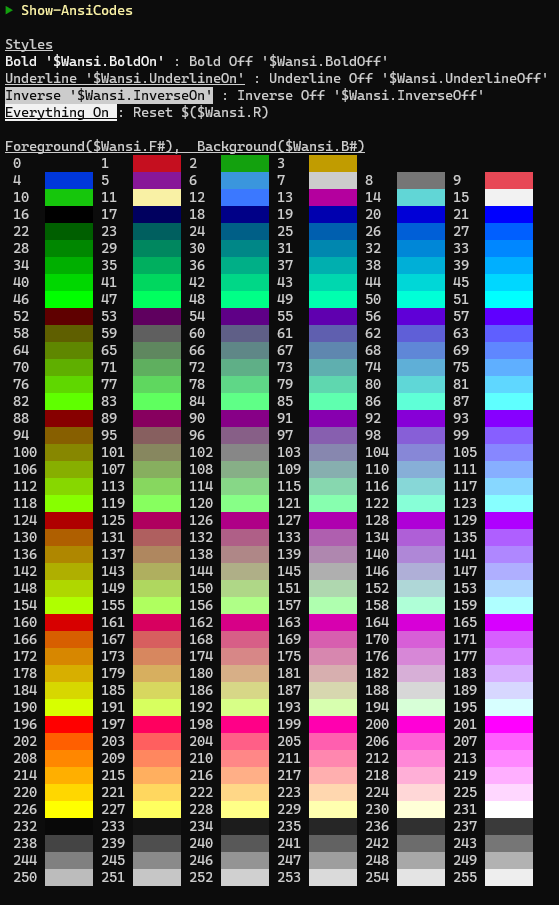
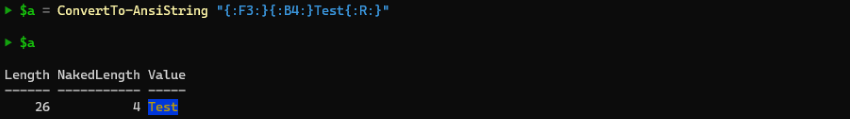

# WieldingAnsi


Table of Contents
=================
<!-- toc -->
- [WieldingAnsi](#wieldingansi)
- [Table of Contents](#table-of-contents)
- [Introduction](#introduction)
  - [Usage](#usage)
  - [Example](#example)
  - [Example](#example-1)
  - [Wansi Tokens](#wansi-tokens)
  - [Installation](#installation)
  - [Prompt Example](#prompt-example)
- [Considerations](#considerations)
- [Future](#future)
  - [Have fun making your Powershell console scripts look a little better with ease!](#have-fun-making-your-powershell-console-scripts-look-a-little-better-with-ease)
<!-- tocstop -->

Introduction
============
WieldingAnsi is Powershell module that contains variables and functions to make displaying text with ANSI escape sequences in the console easier.

:warning: This is a work in progress so the master branch could break your Powershell profile until it is deemed stable.:warning: 

For Windows users this module requires a minimum of Windows 10 1803.  When using this module under Windows it is recommended to use [Windows Terminal](https://github.com/microsoft/terminal).  Any other console may give unpredictable results and might not work at all.

This module has been tested under some WSL distributions and seems to work fine but more testing is required to back up that claim.

Usage
-----
The `Show-AnsiCodes` function displays a table in the console to assist with identifying the Wansi codes to use.  

```powershell
Show-AnsiCodes <no parameters>
```


There are 2 ways to use the codes in your script.  The first way is directly accessing the values with the exported `$Wansi` class.

The following will display the word 'Test' with a Red `$($Wansi.F3)` foreground and Blue `$($Wansi.B4)` background, then reset `$($Wansi.R)` the console to defaults.

```powershell
Write-Host "$($Wansi.F3)$($Wansi.B4)Test$($Wansi.R)`n"
```


The second way is to use [Wansi Tokens](#wansi-tokens) and call either the `ConvertTo-AnsiString` or `Write-Wansi` exported functions.

The `ConvertTo-AnsiString` function accepts a string containing [Wansi Tokens](#wansi-tokens) that get converted to ANSI escape sequences.  

The command only takes one parameter.
```powershell
 ConvertTo-AnsiString [[-Value] <String>]
 ```

Example
-------
```powershell
PS>$a = ConvertTo-AnsiString "{:F3:}{:B4:}Test{:R:}"
```


As you can see the `ConvertTo-AnsiString` returns an object with the following properties.

* **Length** - the length of the string including the ANSI escape codes
* **NakedLength** - the length of the visible text in the string minus the ANSI escape codes
* **Value** - the string with the ANSI escape codes


If you only want to display the string to your host you can Call `Write-Wansi` which will use `Write-Host` to display the string to the console without the need to call `ConvertTo-AnsiString`.

```powershell
Write-Wansi <-Value [string]>
```

Example
-------
The following will produce the same ANSI encoded string as the previous `ConvertTo-AnsiString` example without bothering with the intermediate object.

NOTE: Write-Wansi does not produce a NewLine character so you must include it in your string as an escape character or use Write-Host afterwards to write one manually.
```powershell
Write-Wansi "{:F3:}{:B4:}Test{:R:}`n"
```


Wansi Tokens
------------
Wansi tokens have the same names as the `$Wansi` class properties and are delimited with `{:` and `:}`

The supported style tokens are:

  * `"{:UnderlineOn:}"` - start underlining
  * `"{:UnderlineOff:}"` - stop underlining
  * `"{:BoldOn:}"` - start bold
  * `"{:BoldOff:}"` - stop bold
  * `"{:InverseOn:}"` - start inverse
  * `"{:InverseOff:}"` - stop inverse
  * `"{:R:}"` - reset all attributes

Foreground and background colors can be set using "F" and "B" prefixes followed by the number displayed when calling the `Show-AnsiCodes` function.

* `"{:F#}"` 
* `"{:B#}"` 

Installation
------------
```powershell
Install-Module WieldingAnsi
```
Prompt Example
--------

Here is a prompt function that can be placed in your profile using the exported `$Wansi` class.

```powershell
Import-Module WieldingAnsi

function prompt {
  $line =  "-".PadRight($host.UI.RawUI.WindowSize.Width - $env:USERDOMAIN.Length - 1, "-")
  Write-Host "$($Wansi.F226)$line$($Wansi.F202) $($Wansi.BoldOn)$env:USERDOMAIN$($Wansi.R)"
  Write-Host "$($Wansi.F15)[$($Wansi.F46)$((Get-Location).Path.Replace($($HOME), '~'))$($Wansi.F15)]$($Wansi.R)" -NoNewline
  Write-Host "$($Wansi.F2)`n▶$($Wansi.R)" -NoNewline
 
  return " "
}
```

This produces the following prompt in you Powershell console


You can use the modules `Write-Wansi` function to get the same result with this code.

```powershell
function prompt {
  $line =  "-".PadRight($host.UI.RawUI.WindowSize.Width - $env:USERDOMAIN.Length - 1, "-")
  Write-Wansi "{:F226:}$line{:F202:} {:BoldOn:}$env:USERDOMAIN{:R:}"
  Write-Wansi "{:F15:}[{:F46:}$((Get-Location).Path.Replace($($HOME), '~')){:F15:}]{:R:}"
  Write-Wansi "{:F2:}`n▶{:R:}"
 
  return " "
}

```

Considerations
==============
It gets difficult to handle formatting text containing ANSI escape code due to the fact that strings with ANSI escape sequences are longer than they look. The escape sequences are invisible but still count towards a strings length.  That is the reason `ConvertTo-AnsiString` returns an object with the `NakedLength` property.  The `NakedLength` property contains the length of the input string minus the length of the ANSI sequences.

You can use the `NakedLength` property to do any calculations you might need to create formatted output.  

The `ConvertTo-AnsiString` function is a simple tokenizer that checks tokens against the properties in the `$Wansi` class.  That means that you can add your own tokens by simply adding them to `$Wansi`.

For example if you type the following in the console

```powershell
Write-Wansi "{:X:}Test{:R:}"
```
it would return `"{:X:}Test"` since it does not know of any token named 'X'.

If you were to enter the following in your console
```powershell
Add-Member -InputObject $Wansi -MemberType NoteProperty -Name "X" -Value "This is a "
Write-Wansi "{:X:}Test{:R:}"
```

The result would be `"This is a Test"` since the $Wansi class now contains a property named 'X'.

Just be warned that the if you use `ConvertTo-AnsiString` with a visible custom token like above the `NakedLength` property will not include the custom token length. It does not expect any of the tokens to produce any visible output. 

However, you can create custom tokens that contain any complex or new ANSI escape sequences on your own (e.g. cursor movement) and `NakedLength` should be correct.  Depending on the console you are using you can try adding some of the codes listed at https://en.wikipedia.org/wiki/ANSI_escape_code

For example:

```powershell
Add-Member -InputObject $Wansi -MemberType NoteProperty -Name "DoubleUnderlineOn" -Value "`e[21m"
$GdcTheme.FileAttributesColors["Directory"] = "{:F3:}{:DoubleUnderlineOn:}"
```

This first line will add a property to the `$Wansi` object so that you can use the Wansi Token  `{:DoubleUnderlineOn:}`.  The second line will set the File Attribute "Directory" to have a Yellow foreground with a double underline style.  Once again, remember that not all ANSI escape sequences are supported on all Powershell console hosts.  This particular code woks fine using [Windows Terminal](https://github.com/microsoft/terminal) but failed to work on the default Windows Powershell console.

Future
======
I do plan on enhancing and maintaining this code.  My [WieldingLs](https://github.com/Wielding/WieldingLs) project depends on this which I use across several platforms so I need to keep it working.

## Have fun making your Powershell console scripts look a little better with ease! ##